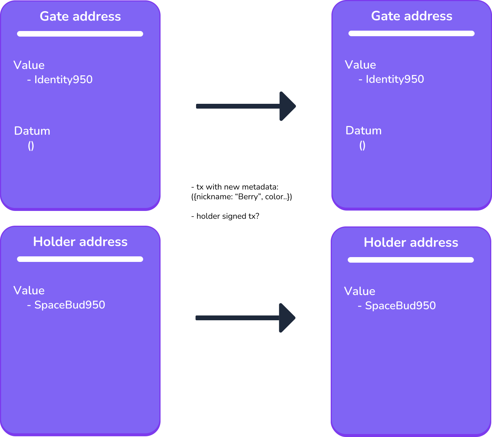
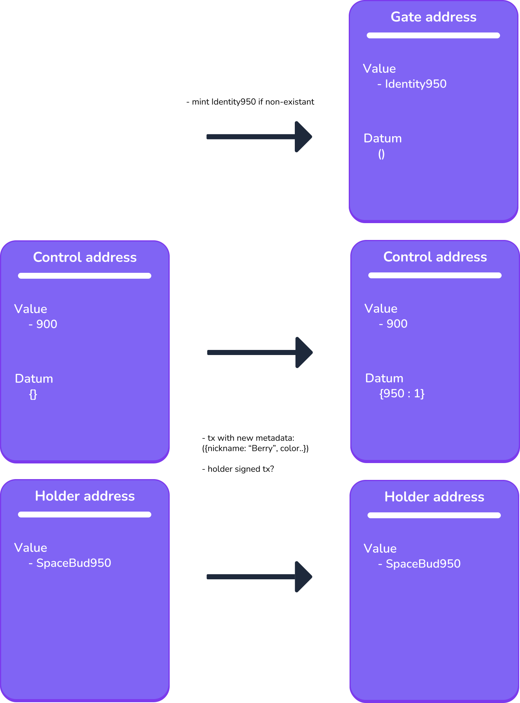

<h2>How SpaceBudz Identity works</h2>

SpaceBudz Identity consists in total of **four** plutus scripts:

- **ControlPolicy**
- **ControlValidator**
- **GateValidator**
- **IdentityPolicy**

Policy here refers to plutus scripts used to mint tokens and Validator to plutus scripts used to spend UTxOs.

The final identity tokens are minted through the IdentityPolicy, which depends on all other three scripts. Only if the execution of the other scripts passes the IdentityPolicy allows to mint an identity token. To understand when this is the case, let's take a look at the general process.

To each SpaceBud one identity token is attached. For example to SpaceBud950 belongs Identity950. If the holder of SpaceBud950 decides now to update its identity, we check whether Identity950 was already minted or not.

**Identity950 exists:**

If Identity950 already exists the token can be found locked at the script address of the GateValidator. Now to make an update to the identity the holder moves the Identity950 from one utxo to another inside the gate address with new metadata attached (the latest transaction containing Identity950 has the valid metadata). The GateValidator makes sure exactly this is happening and that only the holder of SpaceBud950 can proceed with this transaction.
 

 

**Identity950 does not exist:**

This is where it's getting interesting and more complicated. If Identity950 does not exist, it needs to be minted first. Okay but what's the deal, just mint Identity950 and send it to the gate address right? Yeah almost, with a little catch, how do we make sure this token ever gets minted only once? Since there is no global state on Cardano, we cannot simply ask the minting policy if the token already exists. This is where the ControlValidator comes into play. 

We initialize a UTxO with an empty Map at the control address. To mint Identity950 the UTxO needs to be spent and a new UTxO with 950 as entry in the map needs to be created at the control address. If there was no entry with 950 before Identity950 can be minted, otherwise the transaction fails.
This definitely works, however there are still two problems: With only one UTxO we could run into concurrency issues and since there are 10,000 SpaceBudz the datum map needs to potentially hold 10,000 entries, which is quite large and does not fit into a single transaction. To solve this we shard the map state. This is where the ControlPolicy helps. In case of SpaceBudz there exist 100 control tokens each locked in a seperate utxo at the control address. 100 control tokens because each token takes care of 100 identity tokens (100 * 100 = 10,000). The control tokens are enumarated like this: 0, 100, 200, 300... etc.
So to mint Identity950 now we need to find the UTxO with the control token 900, since 900 takes care of the range 900 - 999. If the datum map does not contain the entry 950, Identity950 can be minted successfully. And of course only if the respective SpaceBud holder signs the transaction.
 

 